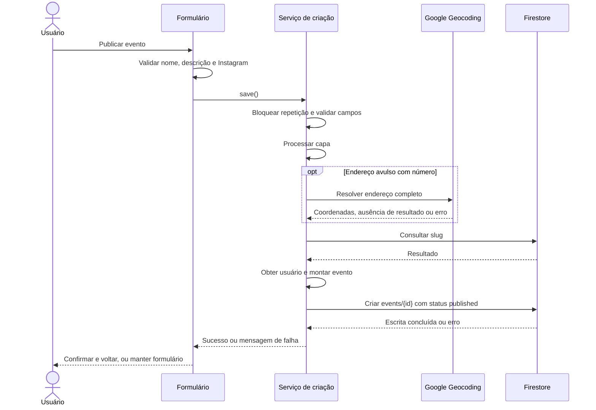

# Criação de evento — especificação para implementação em React

## 1. Objetivo e escopo

Este documento descreve o fluxo encontrado no código Flutter do Então Bora e o contrato necessário para reproduzi-lo no React. Análise feita em 15/09/2026, considerando o estado local dos arquivos, inclusive alterações ainda não commitadas.

**Fluxo atual:** usuário acessa `/events/create`, preenche um formulário, seleciona capa e local, informa início/fim e publica. O cliente grava um documento em `events/{id}` no Cloud Firestore. O evento nasce com `status: "published"`.

Não há chamada a um endpoint próprio `POST /events` neste fluxo. Firebase Auth fornece a sessão; Firestore guarda o evento; Google Places e Geocoding resolvem endereços. A capa é armazenada em Base64 no próprio documento, sem upload para Storage nessa implementação.

As seções de comportamento atual documentam o código existente. As propostas para React e correções sugeridas são indicadas explicitamente. Este documento complementa [MIGRACAO_REACT.md](MIGRACAO_REACT.md).

## 2. Arquivos que definem o comportamento

Todos os caminhos abaixo são relativos à raiz do projeto.

| Responsabilidade | Arquivo |
| --- | --- |
| Rota e injeção de dependências | `lib/app/app_module.dart` |
| Formulário efetivamente usado | `lib/feature/events/presentation/pages/create_event_page.dart` |
| Estado, validações e sequência de gravação | `lib/feature/events/presentation/viewmodels/create_event_viewmodel.dart` |
| Seleção e pré-validação da capa | `lib/feature/events/presentation/widgets/event_cover_step.dart` |
| Busca e seleção do endereço | `lib/feature/events/presentation/widgets/adress_autocomplete_field.dart` |
| Compressão e Base64 | `lib/shared/helpers/image_helper.dart` |
| Geração do slug | `lib/shared/helpers/slug_helper.dart` |
| Conversão da entidade para documento | `lib/feature/events/data/dtos/event_dto.dart` |
| Escrita, consulta de slug e leitura | `lib/feature/events/data/data_source/events_datasource_impl.dart` |
| Encapsulamento dos erros de persistência | `lib/feature/events/data/repositories/event_repository_impl.dart` |
| Estrutura persistida do endereço | `lib/core/location/data/dtos/address_dto.dart` |
| Integração com Google | `lib/core/location/data/data_source/location_data_source_impl.dart` |
| Locais por proprietário | `lib/feature/places/data/datasource/place_datasource.impl.dart` |
| URLs públicas | `lib/shared/helpers/public_url_helper.dart` |

## 3. Entrada, sessão e carregamento inicial

### 3.1 Abertura

- Na Home, a ação de criar evento chama `auth.ensureLogged(context)` antes de navegar. Caso necessário, abre o diálogo de login.
- O painel do parceiro pode abrir a mesma rota passando o estabelecimento selecionado.
- A mesma página também edita eventos: receber `EventEntity` como argumento ativa edição; receber `PlaceEntity` pré-seleciona o local; sem argumento, inicia criação.
- A declaração da rota não contém um guard específico. O método `save()` verifica novamente se existe usuário atual, mas não valida diretamente `role`, `active` ou `isAnonymous`.

Portanto, não deduzir que somente parceiros podem criar eventos a partir do nome da lista de locais. Para React, explicitar a política de acesso e conferir as regras efetivamente implantadas no Firebase; elas não estão documentadas por uma implementação de regras neste fluxo local.

### 3.2 Lista “Meus Locais”

1. Obter usuário atual.
2. Formar um conjunto com `user.id` e `user.partnerId`, quando este estiver preenchido e não vazio.
3. Para cada ID, buscar locais por `ownerId == id` e pelo formato legado `ownerId.id == id`.
4. Unir resultados e eliminar duplicações por ID do local.
5. Se não houver local pré-selecionado e a lista tiver itens, selecionar o primeiro.
6. Se houver local recebido na navegação, substituí-lo pela instância de mesmo ID da lista, quando encontrada.
7. Sem resultados, exibir o modo “Outro endereço”.

Enquanto carrega, a página mostra um skeleton. Falhas de carregamento atribuem `vm.error` e retornam lista vazia; lista vazia pode significar ausência de locais ou falha. No React, é útil distinguir esses estados visualmente.

## 4. Formulário e estado inicial

A página atual apresenta um formulário único, nesta ordem:

| Campo/seção | Estado inicial | Obrigatoriedade/comportamento |
| --- | --- | --- |
| Nome do evento | `""` | Obrigatório; será salvo com `trim()` |
| Descrição | `""` | Obrigatória; campo com quatro linhas; salva com `trim()` |
| Instagram | `""` | Opcional; usuário, não URL |
| Imagem de capa | Sem arquivo | Obrigatória na criação |
| Tipo de local | Meus Locais, se disponíveis | Alterna entre estabelecimento e endereço pesquisado |
| Estabelecimento | Primeiro disponível ou recebido na rota | Obrigatório apenas quando essa for a origem do local |
| Endereço | Sem seleção | Deve ser selecionado na busca quando não houver estabelecimento |
| Número | Valor retornado na busca ou vazio | Opcional; editável |
| Complemento | Vazio na criação | Opcional; editável |
| Início | `null` | Data e hora obrigatórias |
| Término | `null` | Data e hora obrigatórias |
| Gêneros musicais | `[]` | Seleção múltipla opcional |
| Ingresso | `{ type: "free", ticketUrl: null }` | Gratuito ou venda externa |
| Link para compra | Ausente no modo gratuito | Obrigatório para venda externa |
| Ação final | PUBLICAR EVENTO | Desabilitada durante `loading` |

**Galeria e atrações:** o ViewModel possui `photos`, `attractions` e métodos de inclusão/remoção. O documento aceita `gallery` e `attractions`, mas a página atual não oferece controles para cadastrá-las. Na criação normal, ambas são gravadas como listas vazias. Expor esses controles no React representa ampliação da interface.

## 5. Localização: dois caminhos

### 5.1 Estabelecimento cadastrado

Selecionar um local executa `setPlace(place)`, que também limpa `address` do estado do formulário. Ao montar o evento:

- `placeId = place.id`;
- `locationName = place.name`;
- `address = place.address`, convertido para o formato persistido.

O evento guarda uma cópia do endereço do estabelecimento. A criação não consulta geocodificação novamente nesse caminho.

### 5.2 Outro endereço

Selecionar uma sugestão executa `setAddress(address)`, que também limpa `place`.

- Busca após 500 ms sem digitação.
- Consulta somente a partir de três caracteres, após `trim()`.
- Digitar texto não equivale a selecionar um endereço.
- Após seleção, o componente apresenta o endereço e a página permite editar número e complemento.
- Número e complemento são aparados com `trim()` nas mudanças.

Ao montar o evento:

- `placeId = null`;
- `locationName = address.displayName`;
- `address = endereço selecionado`, eventualmente com coordenadas refinadas.

### 5.3 Chamadas Google encontradas no código

Este é o contrato usado pelo cliente atual, não uma validação externa da configuração ou disponibilidade dos serviços.

**Autocomplete:** `POST https://places.googleapis.com/v1/places:autocomplete`

Headers: `Content-Type: application/json`, `X-Goog-Api-Key` obtida da configuração e `X-Goog-FieldMask: suggestions.placePrediction.placeId,suggestions.placePrediction.text`.

```json
{
  "input": "texto digitado",
  "includedRegionCodes": ["br"],
  "languageCode": "pt-BR"
}
```

Para cada previsão com `placeId`, o código busca os detalhes sequencialmente, antes de apresentar a lista:

`GET https://places.googleapis.com/v1/places/{googlePlaceId}`

Headers: `X-Goog-Api-Key` e `X-Goog-FieldMask: id,displayName,formattedAddress,location,addressComponents`.

Detalhes sem sucesso HTTP ou sem localização são descartados. O ID do Google usado nessa consulta **não é** o `placeId` do evento: este último referencia um documento da coleção `places`.

Mapeamento dos detalhes:

| Campo interno | Origem Google |
| --- | --- |
| displayName | `displayName.text`, com fallback em `formattedAddress` |
| street | Componente `route` |
| number | `street_number` |
| neighborhood | `sublocality_level_1`, fallback `sublocality` |
| city | `locality`, fallback `administrative_area_level_2` |
| state | `administrative_area_level_1` |
| country | `country` |
| postalCode | `postal_code` |
| latitude/longitude | `location.latitude` / `location.longitude` |

Os componentes usam `longText`; por isso `state` não é necessariamente uma sigla.

### 5.4 Refinamento ao salvar

Se o endereço avulso tiver número não vazio, chamar:

`GET https://maps.googleapis.com/maps/api/geocode/json`

Parâmetros: `address`, `key`, `language=pt-BR`, `region=br`. `address` concatena rua, número, bairro, cidade, estado, CEP e `Brasil`, separados por vírgulas, omitindo partes vazias. Complemento não entra nessa consulta.

- Se houver resultado válido, atualizar apenas coordenadas e `displayName` com o endereço formatado retornado.
- Se HTTP não for 200, a falha interrompe a publicação pelo repositório/ViewModel.
- Se o status no corpo não for `OK`, não houver resultados ou localização, retornar `null` e manter o endereço original; isso não bloqueia a gravação atual.
- Sem número, pular essa etapa.

## 6. Datas e horários

Cada seleção ocorre em duas partes: calendário e relógio. Cancelar qualquer uma não atualiza a data correspondente. O objeto final é construído com ano, mês, dia, hora e minuto no horário local do dispositivo.

- Calendário de início: de hoje até `DateTime(2100)`.
- Calendário de término: a partir do início selecionado, ou hoje se ausente, até `DateTime(2100)`.
- A validação final exige início e término e rejeita somente `endDate < startDate`.
- **Início e término iguais são aceitos**, apesar de a mensagem dizer que o término deve ser maior.
- A validação de salvamento não verifica explicitamente se o início já passou.
- Persistência usa `Timestamp.fromDate`; não há campo de fuso horário do evento.

Para React, manter data/hora local no formulário e converter explicitamente para o instante a persistir. Não usar uma string de data ISO como substituta do Timestamp no documento. Se o produto quiser fixar o fuso do estabelecimento, isso exige uma decisão adicional, pois o código atual usa o fuso do dispositivo.

## 7. Capa e imagens

1. O seletor abre a galeria com `imageQuality: 85`.
2. Antes de aceitar o arquivo, a interface chama `ImageHelper.fileToBase64()`.
3. O helper comprime com qualidades 90, 80, 70, 60, 50, 40, 30 e 20, até obter uma string Base64 com comprimento **menor que 1.048.487**.
4. Se nenhuma tentativa passar, lança `ImageTooLargeException`.
5. Ao aceitar, armazena o arquivo em `coverPhoto` e limpa o Base64 anterior de `coverImage`.
6. Ao publicar, processa novamente o arquivo e salva o Base64 em `coverImage`.

A string persistida contém **somente Base64**, sem o prefixo `data:image/...;base64,`. Se usar Data URL no navegador, retirar o prefixo antes de persistir e acrescentar o MIME adequado apenas para apresentação.

Esse número é o limite usado pelo helper local; não é uma validação do tamanho total do documento. O código não soma capa, galeria e demais campos antes de gravar. Uma migração deve verificar o tamanho total e os limites do backend escolhido. Mudar imagens para URLs/Storage exige adaptar os leitores existentes; não é equivalente ao contrato atual.

## 8. Validações e mensagens

A interface valida nome, descrição e Instagram pelo formulário. Depois `save()` aplica as demais regras. A tabela registra a ordem de `_validate()`; algumas mensagens abaixo preservam a grafia sem acentos usada no código.

| Ordem | Condição de erro | Mensagem |
| --- | --- | --- |
| 1 | Nome vazio após trim | `Informe o nome do evento.` |
| 2 | Descrição vazia após trim | `Informe uma descrição.` |
| 3 | Sem arquivo de capa e sem capa existente | `Adicione uma imagem de capa para o evento.` |
| 4 | Sem estabelecimento e sem endereço | `Selecione um local.` |
| 5 | Sem início | `Informe a data de inicio.` |
| 6 | Sem término | `Informe a data de termino.` |
| 7 | Término anterior ao início | `A data final deve ser maior que a inicial.` |
| 8 | Venda externa sem URL após trim | `Informe o link para compra do ingresso.` |
| 9 | URL externa não analisável ou sem esquema HTTP/HTTPS | `Informe um link valido.` |

Outras validações:

- Instagram é opcional. Rejeita valores contendo `http`, `www.` ou `instagram.com`, com mensagem `Informe apenas o usuario do Instagram.`. Essa checagem é sensível a maiúsculas e não valida toda a sintaxe de um usuário do Instagram.
- Instagram passa pelo formulário, mas não é revalidado dentro de `_validate()`.
- A URL de ingresso é validada usando a versão aparada, mas o valor original é mantido no ticket e gravado. Não há exigência explícita de hostname na validação Dart.
- Não há mínimo de gêneros, validação de atrações, limite explícito de caracteres do nome/descrição ou obrigatoriedade de número/CEP.
- `isValid` no ViewModel é uma checagem parcial: não inclui capa, ordem das datas nem ticket. Não deve ser usado como única validação no React.

## 9. Slug e link público

O slug é calculado a partir do título em cada gravação:

1. Aplicar trim e minúsculas.
2. Substituir explicitamente os caracteres acentuados suportados por `SlugHelper` por letras sem acento, incluindo ç e ñ.
3. Trocar sequências fora de `[a-z0-9]` por `-`.
4. Colapsar hífens repetidos e remover hífen inicial/final.

Exemplo: `  Então Bora: Rock & Blues!  ` → `entao-bora-rock-blues`.

- Slug vazio: `Informe um titulo valido para gerar o link.`
- Slug encontrado em outro evento: `Ja existe um evento com esse titulo.`
- A consulta usa `events.where('slug', isEqualTo: slug).limit(1)`.
- Na edição, ignora o próprio ID.
- Não adiciona sufixo numérico automaticamente.
- A URL pública gerada pelo helper é `https://entaobora.com.br/events/{slug}`, com fallback no ID quando não há slug.

**Limitações atuais:** a consulta e a gravação são operações separadas, sem reserva transacional do slug. Além disso, `slugExists()` carrega o evento e seu autor; se o autor não puder ser encontrado, o evento pode ser tratado como ausente. Duplicações concorrentes e documentos órfãos precisam ser considerados na migração. A normalização Unicode genérica do JavaScript pode produzir resultados diferentes da tabela explícita do Dart para caracteres fora dessa tabela.

## 10. Sequência completa de publicação



Ordem exata de `save()`:

1. Se `loading` já for verdadeiro, retornar `false`.
2. Definir `loading = true` e limpar erro.
3. Executar `_validate()`; parar na primeira falha.
4. Processar capa; parar em falha.
5. Resolver endereço com número; parar se houver erro.
6. Gerar slug e consultar sua disponibilidade; parar em falha/duplicação.
7. Obter usuário atual; se ausente, retornar `Faca login para criar um evento.`.
8. Processar galeria, quando houver arquivos no estado, e montar a entidade.
9. Converter entidade em DTO e mapa do Firestore.
10. Gerar referência com ID automático em `events` e executar `set()`.
11. Repositório retorna sucesso ou `FailureCreateEvent`; ViewModel retorna booleano e mantém a mensagem em `error`.
12. Em `finally`, sempre definir `loading = false`.

Na criação, nenhum documento de Bora/check-in é criado, nenhum contador é incrementado e não existe etapa de moderação ou rascunho nessa sequência.

Em sucesso, a tela mostra `Evento criado com sucesso!` e fecha com resultado `true`. A Home recarrega os locais; o painel recarrega seus dados. Em falha, mantém a tela e mostra o erro, com fallback de criação. O fluxo Flutter não retorna o ID recém-criado à interface e não navega automaticamente para os detalhes do evento.

## 11. Contrato persistido em events/{id}

Os tipos TypeScript abaixo são uma **especificação de dados para React**, não arquivos implementados ou executados neste repositório. `Timestamp` representa o tipo de timestamp do SDK Firestore adotado no projeto React.

```ts
type MusicGenre =
  | "classicRock" | "hardRock" | "heavyMetal" | "thrashMetal"
  | "deathMetal" | "blackMetal" | "powerMetal" | "doomMetal"
  | "punk" | "hardcore" | "grunge" | "indie" | "alternative"
  | "blues" | "jazz" | "popRock" | "nacional" | "coverBand"
  | "autoral" | "other";

interface EventAddressDocument {
  displayName: string;
  street: string | null;
  number: string | null;
  complement: string | null;
  neighborhood: string | null;
  city: string | null;
  state: string | null;
  country: string | null;
  postalCode: string | null;
  latitude: number;
  longitude: number;
}

interface EventAttractionDocument {
  id: string;
  name: string;
  instagram: string | null;
  image: string | null;
  isHeadliner: boolean;
}

interface EventDocument {
  title: string;
  slug: string;
  description: string;
  placeId: string | null;
  locationName: string;
  address: EventAddressDocument;
  startDate: Timestamp;
  endDate: Timestamp;
  coverImage: string;
  gallery: string[];
  musicGenres: MusicGenre[];
  attractions: EventAttractionDocument[];
  ticket: { type: "free" | "external"; ticketUrl: string | null };
  instagram: string | null;
  boraCount: number;
  checkinCount: number;
  views: number;
  shares: number;
  createdBy: string;
  createdAt: Timestamp;
  updatedAt: Timestamp;
  status: "draft" | "published" | "cancelled" | "finished" | "hidden";
}
```

Regras essenciais do contrato:

| Campo | Valor na criação |
| --- | --- |
| `title`, `description` | Texto aparado |
| `slug` | Derivado do título |
| `placeId` | ID de `places` ou `null` |
| `locationName` | Nome do estabelecimento ou displayName do endereço |
| `address.latitude`, `address.longitude` | Números no mapa address; não GeoPoint |
| `startDate`, `endDate` | Timestamp dos instantes escolhidos |
| `coverImage` | Base64 sem prefixo |
| `gallery`, `attractions` | `[]` na interface atual |
| `musicGenres` | Slugs camelCase selecionados |
| `ticket.type` | `free` ou `external` |
| `instagram` | Texto aparado ou `null` se vazio |
| `boraCount`, `checkinCount`, `views`, `shares` | `0` |
| `createdBy` | ID do usuário atual, como string |
| `createdAt`, `updatedAt` | Mesmo `DateTime.now()` do cliente, convertido para Timestamp |
| `status` | `published` |

**Não gravar** `id`, `isBora` ou `hasCheckedIn` dentro do documento: `id` vem do ID da referência; os dois booleanos são estado de interação do usuário e não fazem parte de `EventDto.toMap()`.

Não gravar um objeto de usuário em `createdBy`, mesmo que a entidade Flutter carregue esse objeto. A escrita canônica usa somente seu ID. Os leitores atuais buscam o autor para reconstruir o evento, portanto o cadastro do usuário também precisa existir.

Todos os campos opcionais presentes no mapa são gravados com `null` quando ausentes. Evitar que `undefined` substitua esses valores no adaptador React.

### 11.1 Exemplo lógico de documento

Os marcadores `Timestamp(...)` e `<BASE64_DA_CAPA>` são ilustrativos: este bloco não é JSON executável.

```text
events/<ID_AUTOMATICO>
{
  title: "Então Bora Rock",
  slug: "entao-bora-rock",
  description: "Noite de rock com bandas locais.",
  placeId: null,
  locationName: "Rua Exemplo, 123, São Paulo, Brasil",
  address: {
    displayName: "Rua Exemplo, 123, São Paulo, Brasil",
    street: "Rua Exemplo", number: "123", complement: "Salão superior",
    neighborhood: "Centro", city: "São Paulo", state: "São Paulo",
    country: "Brasil", postalCode: null,
    latitude: -23.5505, longitude: -46.6333
  },
  startDate: Timestamp("2026-10-10T22:00:00Z"),
  endDate: Timestamp("2026-10-11T02:00:00Z"),
  coverImage: "<BASE64_DA_CAPA>",
  gallery: [], musicGenres: ["classicRock", "nacional"], attractions: [],
  ticket: { type: "external", ticketUrl: "https://example.com/ingressos" },
  instagram: "@entaoborarock",
  boraCount: 0, checkinCount: 0, views: 0, shares: 0,
  createdBy: "<UID_DO_USUARIO>",
  createdAt: Timestamp("<INSTANTE_DA_CRIACAO>"),
  updatedAt: Timestamp("<MESMO_INSTANTE_DA_CRIACAO>"),
  status: "published"
}
```

### 11.2 Rótulos dos gêneros

| Slug | Rótulo |
| --- | --- |
| classicRock | Classic Rock |
| hardRock | Hard Rock |
| heavyMetal | Heavy Metal |
| thrashMetal | Thrash Metal |
| deathMetal | Death Metal |
| blackMetal | Black Metal |
| powerMetal | Power Metal |
| doomMetal | Doom Metal |
| punk | Punk |
| hardcore | Hardcore |
| grunge | Grunge |
| indie | Indie |
| alternative | Alternative Rock |
| blues | Blues |
| jazz | Jazz |
| popRock | Pop Rock |
| nacional | Rock Nacional |
| coverBand | Cover |
| autoral | Autoral |
| other | Outro |

## 12. Edição: diferenças que afetam o formulário compartilhado

- O argumento de evento preenche título, descrição, Instagram, endereço, datas, capa, gêneros, atrações e ingresso.
- O carregamento tenta reencontrar o estabelecimento pelo `placeId` na lista acessível. Se não encontrar, passa para outro endereço; uma gravação nesse estado pode perder a associação `placeId` original.
- Preserva `id`, `createdBy`, `createdAt`, status e contadores.
- Atualiza `updatedAt` e recalcula slug; mudar título pode mudar o link público.
- Usa `update()` sobre `events/{id}`.
- Sem novos arquivos de galeria, preserva a galeria anterior; com arquivos, substitui a lista inteira. Uma lista nova vazia não remove a galeria antiga nesse algoritmo.
- Pode reutilizar a capa existente. Selecionar outra limpa o Base64 em memória; remover essa seleção depois pode deixar o formulário sem capa, pois a anterior não é restaurada automaticamente.
- O complemento existente é carregado no endereço, mas seu campo visual não recebe `initialValue` na página atual.

## 13. Organização proposta para React

Esta divisão é uma proposta de implementação, sem exigir biblioteca específica de formulário ou de estado:

```text
features/events/create/
  CreateEventPage.tsx          composição, carregamento e retorno à origem
  EventForm.tsx               campos e mensagens de validação
  EventCoverInput.tsx         seleção, preview e processamento
  EventLocationInput.tsx      escolha de local/endereço
  useCreateEvent.ts           estado e coordenação da publicação
  eventValidation.ts         validações puras
  eventMapper.ts             formulário -> EventDocument
  eventRepository.ts         consulta de slug e persistência
  eventTypes.ts              tipos de formulário e documento
services/
  placesRepository.ts        locais próprios e legado ownerId.id
  addressService.ts          autocomplete, detalhes e geocodificação
  imageService.ts            compressão e Base64 compatível
```

Estados de interface propostos: carregando sessão/locais, editando formulário, buscando endereço, processando capa, publicando, falha e sucesso. Manter o bloqueio de publicação também no coordenador, pois desabilitar o botão sozinho não cobre chamadas simultâneas ao serviço.

O estado de localização pode ser uma união explícita para evitar dois locais simultâneos:

```ts
type EventLocationSelection<Place> =
  | { mode: "registered"; place: Place | null }
  | { mode: "custom"; address: EventAddressDocument | null };
```

Contrato proposto do serviço de criação:

```text
createEvent(form, session)
  -> validar formulário completo
  -> processar capa
  -> resolver endereço quando necessário
  -> gerar e verificar slug
  -> confirmar usuário
  -> montar documento com tipos persistidos corretos
  -> gravar events/{id}
  -> retornar { id, slug }
```

Retornar `{ id, slug }` é uma melhoria proposta sobre o booleano atual. Após sucesso, atualizar os dados da origem e voltar à listagem/painel. Ir aos detalhes é uma alternativa de experiência, não comportamento já existente.

## 14. Pontos a corrigir ou decidir na migração

| Comportamento/limitação observada | Tratamento proposto para React |
| --- | --- |
| Trocar o rádio do tipo de local altera apenas a interface, mantendo seleção anterior no ViewModel | Limpar a seleção incompatível ao trocar de modo |
| Digitar ou limpar o autocomplete limpa somente a seleção interna do widget; endereço antigo pode permanecer no ViewModel | Invalidar o endereço do formulário e exigir nova seleção |
| Busca assíncrona não possui proteção contra respostas antigas | Ignorar respostas cujo texto não corresponde mais à busca atual |
| `ticket.copyWith(ticketUrl: null)` preserva a URL anterior por usar `??` | Ao escolher gratuito, construir explicitamente `{ type: "free", ticketUrl: null }` |
| `isValid` é parcial e Instagram só é validado na UI | Centralizar validação completa no serviço/formulário |
| Consulta de slug não é atômica e depende da leitura do autor | Consultar existência documental e definir reserva atômica se unicidade for requisito |
| Validação de datas aceita igualdade | Manter igualdade para paridade ou aprovar regra de duração positiva |
| Base64 é validado por imagem, sem tamanho total | Validar documento completo; tratar mudança de armazenamento como migração |
| Datas de auditoria dependem do relógio do cliente | Avaliar timestamps de servidor como mudança explícita |
| Edição escreve contadores do objeto carregado | Evitar sobrescrever métricas atualizadas por outros usuários com estado antigo |
| Acesso direto à rota não tem guard específico | Resolver sessão e autorização de forma consistente com o backend |

Essas propostas não foram aplicadas ao Flutter nesta tarefa. Elas evitam transformar inconsistências do código atual em requisitos intencionais do novo produto.

## 15. Critérios de aceite para a implementação React

### Fluxo principal

- [ ] Criar evento com estabelecimento e confirmar ID, nome e cópia do endereço no documento.
- [ ] Criar evento em outro endereço, com latitude/longitude numéricas dentro de `address`.
- [ ] Carregar locais por UID e partnerId, aceitando ownerId string e legado objeto, sem duplicação.
- [ ] Permitir endereço avulso quando não existem estabelecimentos.
- [ ] Salvar capa em Base64 sem prefixo e tratar falha de processamento.
- [ ] Persistir título/descrição aparados, status published, quatro contadores zero e autor como UID.
- [ ] Gravar datas como Timestamp e conferir a exibição após leitura no fuso esperado.
- [ ] Sucesso somente após resolução da escrita; atualizar a origem e exibir confirmação.

### Validações e falhas

- [ ] Bloquear campos obrigatórios ausentes, término anterior ao início e venda externa sem link válido.
- [ ] Testar explicitamente início igual ao término conforme a decisão de produto.
- [ ] Validar Instagram opcional sem exigir preenchimento.
- [ ] Testar título com acentos/pontuação, slug vazio e slug já existente.
- [ ] Impedir envio repetido enquanto publica.
- [ ] Preservar formulário em falha de gravação, sessão ausente ou falha na geocodificação.
- [ ] Diferenciar ausência de resultados de busca e erro de serviço.
- [ ] Testar mudança de modo de local, limpeza do endereço e respostas de busca fora de ordem.
- [ ] Testar troca de ingresso externo para gratuito sem URL residual, se adotada a correção proposta.

### Compatibilidade e edição

- [ ] Confirmar leitura do evento React pelo DTO Flutter existente.
- [ ] Não gravar id, isBora ou hasCheckedIn como campos do evento.
- [ ] Não confundir ID de estabelecimento interno com ID do Google Places.
- [ ] Manter gêneros com slugs camelCase e listas vazias quando não preenchidas.
- [ ] Se compartilhar tela com edição, preservar autoria, criação, status e galeria conforme o contrato decidido.
- [ ] Verificar falhas reais de autorização e tamanho com a configuração Firebase do ambiente de destino.

## 16. Limites desta documentação

O fluxo foi verificado por leitura do código local da página, ViewModel, entidades, DTOs, helpers, repositórios e datasources. Não foram executadas gravações no Firebase, chamadas Google ou testes da futura interface React. Regras implantadas, credenciais operacionais, índices e permissões do ambiente de destino precisam ser conferidos durante a implementação.
